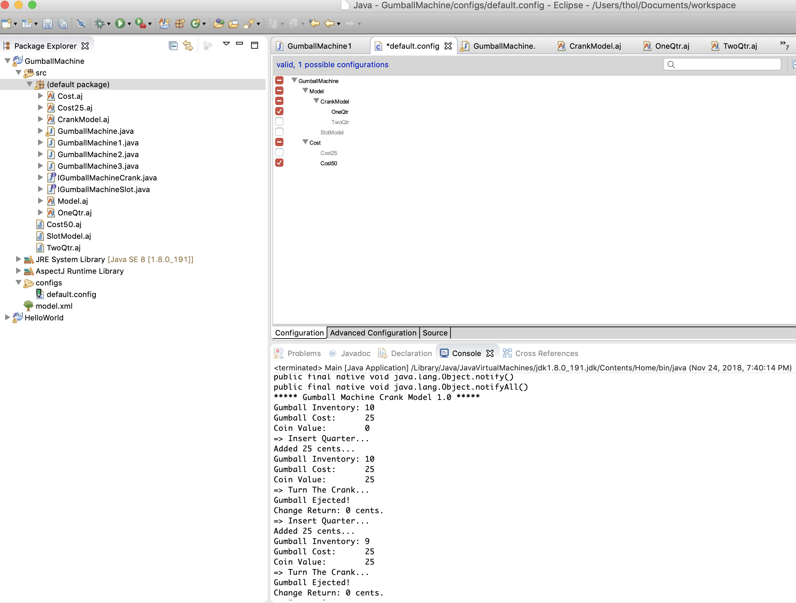
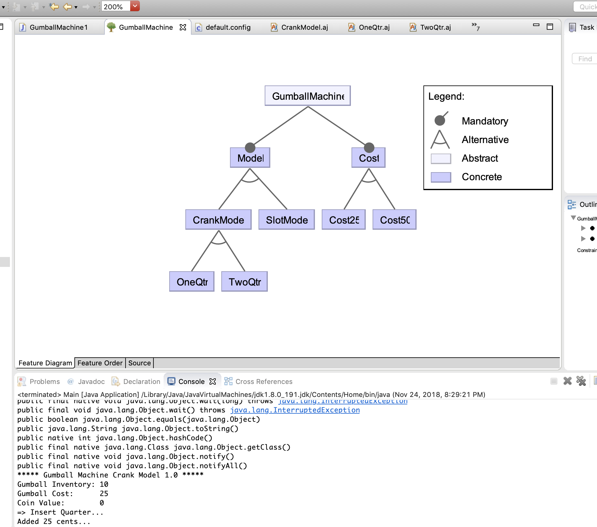
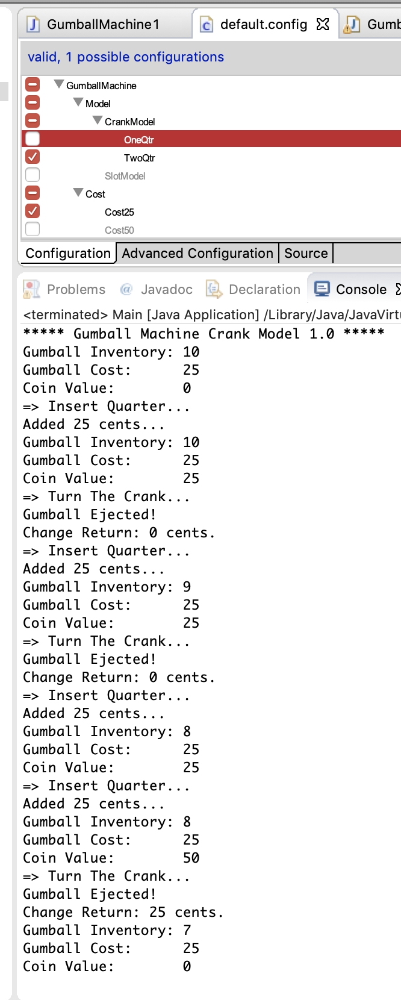
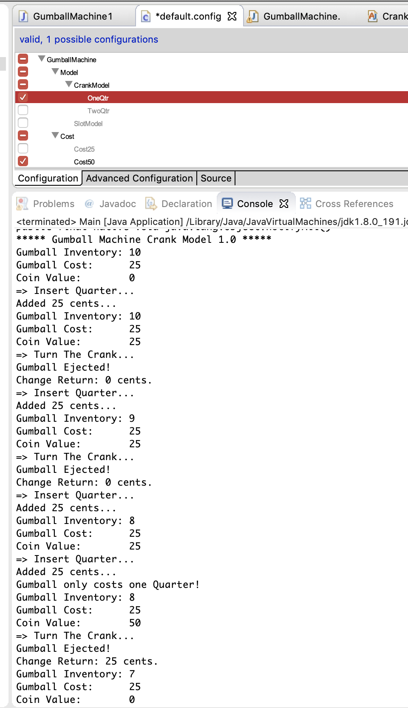
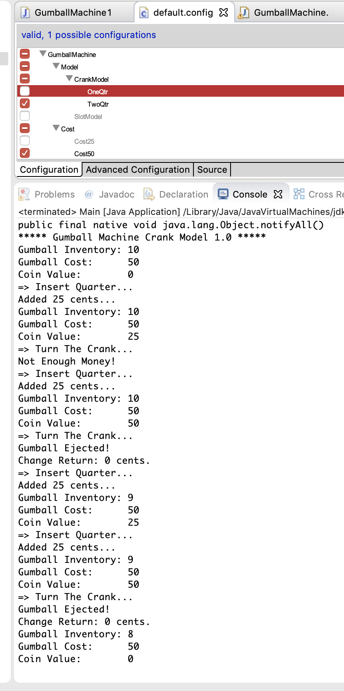
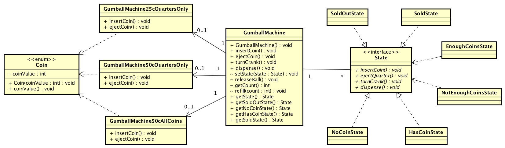

# Gumball Machine Feature IDE implementation

## Eclipse screenshot

## Feature screenshots

### Feature XML

### Cost 25 cents Takes 1 Quarter at a time

### Cost 50 cents Takes 1 Quarter at a time

### Cost 50 cents Takes 2 Quarter

## Comparison with Lab #1 Gumball Machine Solution

### Lab1 Project using Greenfoot/BlueJ
Lab1 instantiated classes for each type of Gumball Machine as mentioned below:
1. GumballMachine25cQuartersOnly
2. GumballMachine50cQuartersOnly
3. GumballMachine50cAllCoins

### Lab10 Project using Feature IDE
Lab10 uses _Feature Oriented Software Development_ technique to abstract out the features from problem space.

Lab10 improves the software development using a teching called "Weaving" that happens during runtime. This technique improves software development and solution design through 3 different areas.

## Managing Variation
In Gumball machine problem space has 3 variations for the types of machines. This can be modeled as a feature-sets.

## Code Reuse
Gumball base class is reused for all the features with variations inserted as needed.

## Code Structure
Gumball machine code is well structured with all variations removed into separate features that can be weaved and implmented during run-time.
